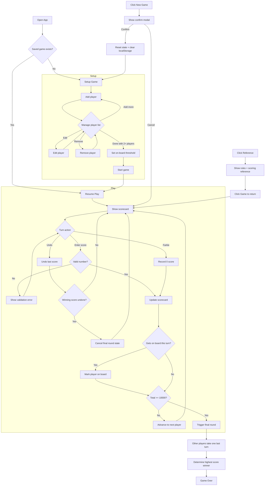

# Farkle Scorecard

An easy to use scorecard for Farkle so you never need to find pen and paper again.

## Features

- **Player management** — Add, edit, and remove players during setup.
- **Configurable on-board threshold** — Choose 500, 750, or 1000 as the minimum score to get on the board.
- **Win detection** — First player to 10,000 triggers a final round so every other player gets one more turn.
- **Farkle tracking** — Quick "Farkle!" button to record a zero-point turn, highlighted in red in turn history.
- **Undo** — Undo the last score entry for any player.
- **Current player highlight** — The active player's scorecard is visually highlighted.
- **Input validation** — Prevents empty or duplicate player names and negative scores.
- **Persistence** — The React app saves game state to localStorage so you can resume after refreshing.
- **Scoring reference** — Built-in reference card for Farkle scoring combinations.

## User Flow Diagram (Mermaid)



## Project Structure

This monorepo uses [NPM Workspaces](https://docs.npmjs.com/cli/v9/using-npm/workspaces?v=true) and contains two feature-equivalent frontend apps that share game logic packages.

```
farkle-sc/
├── packages/
│   ├── types/      # @fsc/types — Shared TypeScript types and constants
│   └── state/      # @fsc/state — Framework-agnostic game logic (pure functions)
├── apps/
│   ├── react/      # @fsc/react — React 19 + Vite
│   └── angular/    # @fsc/angular — Angular 21 + NgRx
└── _templates/     # Hygen code generation templates
```

Game logic lives in the shared packages so both apps stay in sync. When adding or changing scoring rules, player management, or win conditions, update `@fsc/state` — never duplicate logic in individual apps.

## Getting Started

Requires Node.js and npm 7+.

```bash
npm install
```

### React

```bash
npm run start -w @fsc/react
```

Runs on [http://localhost:3000](http://localhost:3000).

### Angular

```bash
npm run start -w @fsc/angular
```

## Testing

### React (Vitest)

```bash
npm test -w @fsc/react
```

### Angular (Karma + Jasmine)

```bash
cd apps/angular && npx ng test --no-watch --browsers=ChromeHeadless
```

## Linting

```bash
npm run lint
```

## Code Generation

### Angular components and pages

```bash
npm run ng generate component components/<name> -w @fsc/angular
npm run ng generate component pages/<name> -w @fsc/angular
```

## Code Style

- **Prettier**: 4-space indent, 100 char width, single quotes, ES5 trailing commas.
- **ESLint**: TypeScript rules with sorted imports (external → builtin → internal → sibling → parent → index).
- Files use kebab-case. Components and classes use PascalCase. Angular selectors are prefixed with `fsc-`.

## Game Rules Quick Reference

Farkle is a dice game where players roll six dice to accumulate points:

| Combination    | Points             |
| -------------- | ------------------ |
| Single 1       | 100                |
| Single 5       | 50                 |
| Three 1s       | 1,000              |
| Three 2s       | 200                |
| Three 3s       | 300                |
| Three 4s       | 400                |
| Three 5s       | 500                |
| Three 6s       | 600                |
| Four of a kind | 2× three of a kind |
| Five of a kind | 4× three of a kind |
| Six of a kind  | 8× three of a kind |
| 1-2-3-4-5-6    | 3,000              |
| Three pairs    | 1,500              |

A player must reach the on-board threshold (default 500) in a single turn to start accumulating. First to 10,000 triggers a final round — all other players get one more turn. Highest score wins.
